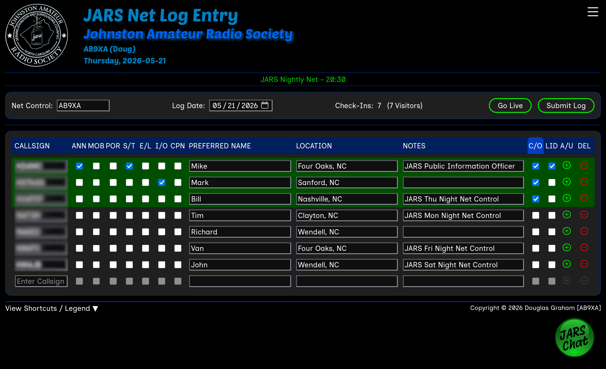
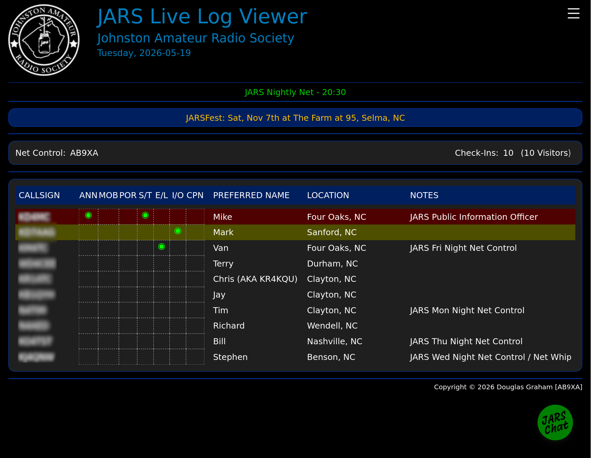
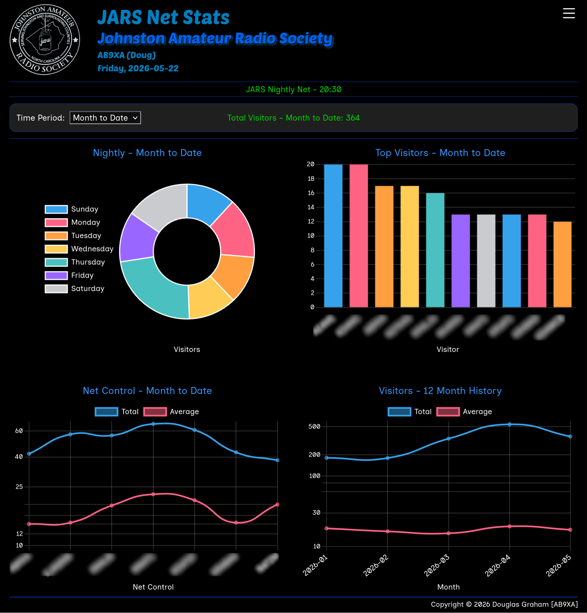

# JARS Net Logger
Created by Douglas Graham, callsign AB9XA

## Overview
The concept for this application was derived from a desire of the Johnston Amateur Radio Society (JARS), based in Johnston County, NC, US, to have a common logging platform for nightly nets.

It was written based on my personal habits for logging nets and suggestions from KO4TST, KM4JB and N4TIM. It has facilities for one of our clubs long standing awards, the Lid of the Month. The LoM receives special privileges on a net -or- may make the net operator Lid bait for not recognizing them properly.

Multiple Nets can be configured, which get tracked independently, while sharing the same database and server installation. Nets can be configured in the Net Manager interface off of the Admin menu.

Users can be assigned one of 3 roles:
- Admin User
  - Full access to all areas
- Standard user
  - Access to all but Admin tools
- Guest User
  - Guest accounts cannot change the account password, used here for substitute net control
  - By setting a prefix in the config.php file, any name created that matches that prefix will be considered a guest account; e.g., Prefix JARS matches JARS-Guest, JARSGuest01 JARS14727, etc. so try not to use callsign prefixes (unless you want everyone with that callsign prefix to be a guest)

The client side is web based, running as a JavaScript application in the client web browser. No software needs to be installed on the client machine.

The server side is a common Linux LAMP setup running Apache, MariaDB and PHP. Node.js need to be installed as well for the live log and chat features to work.

Features:
- Log entry for nets with shortcuts to set flags for each entry (/S for short time, /M for mobile, /P for portable, etc.)
- Suffix shortcuts for entry; entering -XXX (e.g. -9XA) will perform a suffix search. If a single entry is found it will get pulled in as if you typed the entire callsign. If multiple matches are found, a popup with the matching callsigns will appear, allowing net control to select the one they want
- A live log viewer for guests to monitor the net session in real time
- Group chat that links users from the live log viewer page and the net control log entry page. You can check in via chat or just have a chat with everyone while viewing or calling a net.
- Net statistics; track nets by time period - week, past month, month to date, past year, year to date; view visitor counts by night of the week, the top 10 visitors, net control numbers and 12 month history of visitor numbers
- Log viewer; View past logs by selecting the date to review

NOTE: All features are isolated based on the net you log into or select before viewing a live log. This includes chat, stats, viewing previous logs, etc. This means if you have 2 nets running at the same time on different repeaters, they are treated as separate entities across the board - viewers of net A can only chat with other users or net control on net A, and the same applies for anyone on net B - they can only interact with others on the same net

Admin tools
- Net management; Tool to add/edit/delete and/or activate/deactivate nets. Deactivating a net makes it unavailable from the login Net selection box but doesn't delete the net or its associated data
- User management; add/delete users, manage admins, change user passwords
- Announcement management; program banner messages to be displayed on the live log viewer page. Add messages, set the dates they should start/end (or leave the end date open ended) and the page will automatically rotate through them every 15 seconds
- Export of the `visitors` or `logs` tables in CSV or SQL format. Net logs can also be exported in ADI/ADIF format.
- Update callsigns; If an operator gets a new callsign (e.g., vanity), this tool adds their new callsign to the visitors table (if it doesn't already exist), updates log entries to reflect the new callsign (to move their data/stats over), marks the new callsign with XNEWX (AKA XOLDX) and marks the old callsign with XOLDX (Now XNEWX).

## Pre-Install
Package Requirements
- `mariadb-server`
- `apache2`
- `php`
- `libapache2-mod-php`
- `php-mysql`
- `Node.js:`
  - `session.io`
  - `express`
  - `bufferutil` (optional)
  - `utf-8-validate` (optional)

Before running the installer, the following steps need to be completed.

1. Install and configure MariaDB server
   - Run `mariadb_secure_installation` and set the root password
   - Create an empty database to be used\
`CREATE DATABASE 'jars_net_logger' DEFAULT CHARACTER SET utf8mb4 COLLATE utf8mb4_general_ci;`
   - Create a new MariaDB user with full permissions to the new database\
`CREATE USER 'jars-net-logger'@'localhost' IDENTIFIED BY 'password';`\
`GRANT ALL PRIVILEGES ON jars_net_logger.* TO 'jars-net-logger'@'localhost';`
2. Install and configure Apache
   - Ensure SSL is properly configured
   - Verify any firewall rules needed are in place. Only port tcp/443 inbound needs to be exposed
   - Create a virtual directory for the application (e.g., `/var/www/html/jars`)
3. Install PHP and edit `/etc/php/8.x/apache2/php.ini`:
   - Set `date.timezone` (e.g., `date.timezone = America/New_York`)
   - Set `session.cookie_lifetime = 0`
   - Set `session.gc_maxlifetime` to be longer than your longest net in seconds (e.g., `session.gc_maxlifetime = 14400`)
4. Install and configure Node.js componenets
   - Copy the index.js and package.json files to an empty directory and run `npm install`
   - If you want it to run as a service, you can create a .service file to run it, just make sure it runs under the user that has access to the directory where index.js resides. See `/systemd/jars-chat.service` for an example. Create the new .service file in `/etc/systemd/system` then run `sudo systemctl daemon-reload`

## Installation

- `git clone https://github.com/LDZPLN1/JARS-Net-Logger-Public.git`
- `cd BASH`
- `./build_installer.sh` (This will create a file named `jars-logger.tar.gz` in `JARS-Net-Logger-Public`).
- Copy `jars-logger.tar.gz` to the machine you want to install it on and unpack it with `tar -xf jars-logger.tar.gz`
- `cd build`
- `./install.sh`

Answer the prompts. It will load the initial database structure, configure Apache and copy the files to the Apache virtual directory. After the script runs, the application can be customized by editing the /var/www/html/[vdir]/config.php file:

* Database connection information (set by install script)\
  `const DB_HOST = '';`\
  `const DB_NAME = '';`\
  `const DB_USER = '';`\
  `const DB_PASSWORD = '';`

* Logo information\
  `const LOGO_IMAGE = 'images/jars_logo.png';`\
  `const LOGO_HEIGHT = 128;`\
  `const LOGO_WIDTH = 128;`

* Org information - short name / long name\
  `const ORG_NAME = 'JARS';`\
  `const ORG_LONG_NAME = 'Johnston Amateur Radio Society';`

* Guest account prefix\
  `const GUEST_PREFIX = 'JARS';`

* External web links to display on nav menu\
  `const WEB_LINKS = [`\
  `  'JARS.net' => 'https://www.jars.net/',`\
  `  'QRZ' => 'https://www.qrz.com/',`\
  `  'ARRL' => 'https://www.arrl.org/'`\
  `];`

## Updating

Similar to installation, but does not alter the config.php file of an existing installation and only adda/updates new/modified files

- `git clone https://github.com/LDZPLN1/JARS-Net-Logger-Public.git`
- `cd BASH`
- `./build_installer.sh`
- Copy `jars-logger.tar.gz` to the machine you want to install it on and unpack it with `tar -xf jars-logger.tar.gz`
- `cd build`
- `./update.sh`
